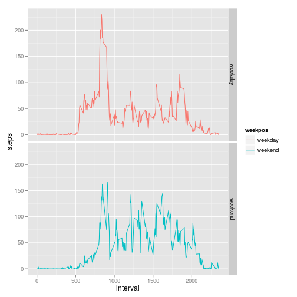

# Reproducible Research: Peer Assessment 1


## Loading and preprocessing the data

Load the activity monitoring data. The script assumes that [activity.zip](https://d396qusza40orc.cloudfront.net/repdata%2Fdata%2Factivity.zip) is present in the current working directory.


```r
if (!file.exists("activity.csv")) {
  unzip("activity.zip")
}
```

Open the data and print out a few lines.


```r
dataset <- read.csv("activity.csv")
head(dataset)
```

```
##   steps       date interval
## 1    NA 2012-10-01        0
## 2    NA 2012-10-01        5
## 3    NA 2012-10-01       10
## 4    NA 2012-10-01       15
## 5    NA 2012-10-01       20
## 6    NA 2012-10-01       25
```

## What is mean total number of steps taken per day?

The script removes all NAs then aggregates the number of steps over the date.
After that a histogram is draw and the mean and median are printed.


```r
dailysteps <- dataset[!is.na(dataset$steps),]
dailysteps <- aggregate(dailysteps$steps, list(dailysteps$date), "sum")

names(dailysteps)[1] <- "date"
names(dailysteps)[2] <- "total"

hist(dailysteps$total, breaks=10, xlab="Number of Steps", 
     main="Histogram of steps taken per day")
```

 

```r
summary(dailysteps$total)
```

```
##    Min. 1st Qu.  Median    Mean 3rd Qu.    Max. 
##      41    8840   10800   10800   13300   21200
```

## What is the average daily activity pattern?

Now the script averages the number of steps taken in an interval over all days.
It draws the result in a time series diagram and outputs the interval with the largest average.


```r
averageininterval <- dataset[!is.na(dataset$steps),]
averageininterval <- aggregate(averageininterval$steps, 
                               list(averageininterval$interval), "mean")
names(averageininterval)[1] <- "interval"
names(averageininterval)[2] <- "average"

plot.ts(averageininterval$interval, averageininterval$average, 
        xlab="Interval", ylab="Average", 
        main="Average number of steps taken in an interval over all days")
```

 

```r
sortedaverageininterval <- averageininterval[order(averageininterval$average, 
                                             decreasing=TRUE),]
sortedaverageininterval[1,]
```

```
##     interval average
## 104      835   206.2
```

## Inputing missing values

Let's create a data frame of all the NA values to get a better look at them.


```r
navalues <- dataset[is.na(dataset$steps),]
nrow(navalues)
```

```
## [1] 2304
```

```r
length(unique(navalues$date))
```

```
## [1] 8
```

```r
unique(summary(dataset$date))
```

```
## [1] 288
```

We have a total number of 2304 missing values across eight different days. From the last output we can see that there are always 288 measurements per day. 2304 divided by eight is 288. That means that we have 8 completely missing days while existing days with measurements are all complete.

The already calculated data from before will be used to fill in the missing values and create a new dataset so that each interval in a missing day is equal to the mean of the days with existing data.


```r
missingdates <- unique(navalues$date)
cdataset <- dataset[!is.na(dataset$steps),]
missingdates <- rep(missingdates, each=288)
missingvalues <- rep(averageininterval$interval, 8)
missingvalues <- cbind(averageininterval, missingdates)
names(missingvalues)[2] = "steps"
names(missingvalues)[3] = "date"
cdataset <- rbind(cdataset, missingvalues)
```

Now draw a histogram and print the mean and median as in the first part of the document. Both values shouldn't have changed since only averages have been added to the dataset.


```r
dailysteps <- aggregate(cdataset$steps, list(cdataset$date), "sum")

names(dailysteps)[1] <- "date"
names(dailysteps)[2] <- "total"

hist(dailysteps$total, breaks=10, xlab="Number of Steps", 
     main="Histogram of steps taken per day")
```

 

```r
summary(dailysteps$total)
```

```
##    Min. 1st Qu.  Median    Mean 3rd Qu.    Max. 
##      41    9820   10800   10800   12800   21200
```

## Are there differences in activity patterns between weekdays and weekends?

We will now add a new column to our data to indicate whether the actual measurement is from a weekday or from the weekend. For that the date is converted to a posix date. The "wday" property of the posix date denotes the weekday where 0 stands for sunday, 1 for monday etc.


```r
isweekend <- function(x) {
  weekday <- as.POSIXlt(x)$wday
  if (weekday == 0 | weekday == 6) {
    "weekend"
  } else {
    "weekday"
  }
}

cdataset$weekpos <- sapply(cdataset$date, FUN="isweekend")
```

Now plot the average steps taken per interval split up between weekdays and weekends.


```r
averages = aggregate(steps ~ interval + weekpos, data=cdataset, FUN="mean")

library(ggplot2)
ggplot(averages, aes(x = interval, y = steps)) +
  geom_line(aes(colour=weekpos)) +
  facet_grid(weekpos ~ ., scales = "fixed")
```

 

